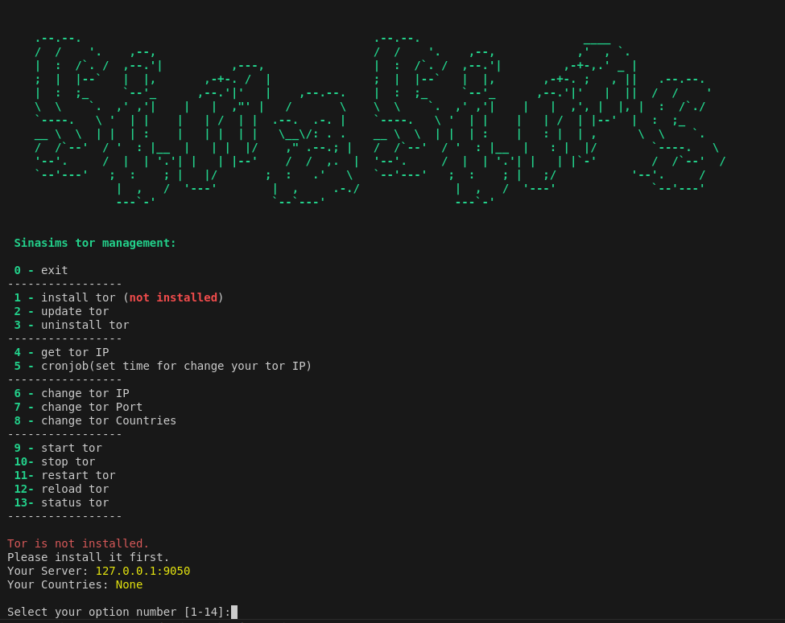

[فارسی](/README_FA.md) 

<p align="center"><a href="#"></a></p>


# What is TorSina?
**A program for managing Tor, written in Python.**

**If this project is helpful to you, you may wish to give it a**🌟

**If you like this program, I will add more options to it.**


## How to Run?
**Run the following script on your server (Debian or Ubuntu):**
```
bash <(curl -Ls https://raw.githubusercontent.com/sinasims/torsina/refs/heads/main/install.sh)
```

## Menu (v1)

<p align="center"><a href="#"></a></p>

## My Telegram ID

If you have any questions, feel free to ask me.

[sinasimss](https://t.me/sinasimss) 

## Donation Link

Donate TRX (TRC-20) to support our project:

<a href="https://nowpayments.io/donation?api_key=5E3Y26C-TSZMQQZ-KZVPEH6-2H6FXYS" target="_blank" rel="noreferrer noopener" style="text-align:left;">
    
</a>

```
TUyrabtvZY2GekmK7gyJzSML4gfktAvz68
```
Thanks for your support!
